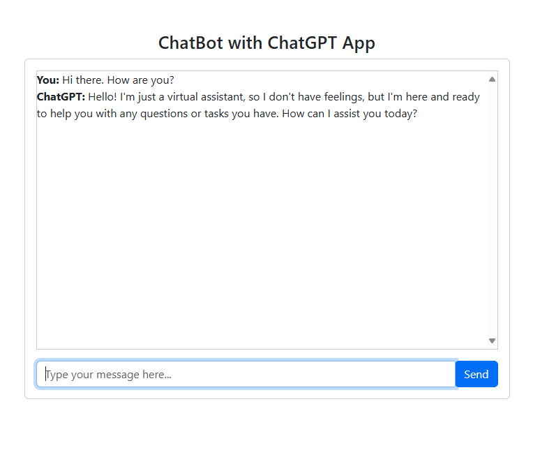
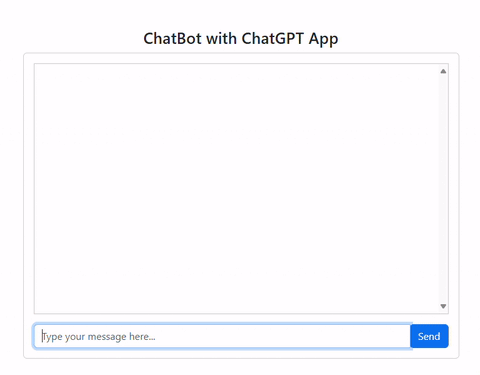

# Chatbot-Programmier-Tutorial
Dies ist ein Tutorial, um deinen eigenen ChatGPT-Chatbot-Client zu programmieren. Diese Webanwendung verwendet das Flask Webanwendungs-Framework und Bootstrap UI-Bibliotheken für die grafische Gestaltung. Ein OpenAI-Benutzerkonto und ein OpenAI API-Schlüssel werden noch von dir benötigt. Ein OpenAI Benutzerkonto kannst du kostenfrei erstellen. Um einen Enwickler API-Schlüssel zu erhalten ist es nötig sein Benutzerkonto in den Entwicklereinstellungen um 5 € Guthaben aufzuladen. (Stand: Juni 2024)

 
  


## Erstellen der App

Die Erstellung einer Webanwendung mit Flask (Python für das Backend) und Bootstrap (für das Frontend), kann in mehrere Hauptteile unterteilt werden:

1. **Backend (Flask-Anwendung)**
2. **Frontend (HTML mit Bootstrap)**
3. **Integration (JS für asynchrone Interaktion)**

### Schritt-für-Schritt-Anleitung

1. **Installiere die erforderlichen Pakete**:
   Stelle sicher, dass Flask und OpenAI installiert ist. Die Python-Pakete mit pip installieren:
   ```bash
   pip install flask openai


2. **Projektstruktur**:
   ```
    chatbot_app/
    ├── templates/
    │   └── index.html
    ├── static/
    │   └── script.js
    ├── app.py
    └── requirements.txt
    ```

3. **Backend: `app.py`**:
Dies ist die Backend-Datei für die Flask-Anwendung.

    ```python
    from flask import Flask, render_template, request, jsonify
    import openai

    app = Flask(__name__)

    # Richte deinen OpenAI-API-Schlüssel ein.
    openai.api_key = 'GIB HIER DEINEN OPENAI-API-KEY EIN!'

    conversation_history = []

    @app.route('/')
    def home():
        return render_template('index.html')

    # Definiere einen /chat-Endpunkt, der POST-Anfragen verarbeitet, um Nachrichten vom Benutzer abzurufen, diese an die OpenAI-API zu senden und Antworten zurückzugeben.
    @app.route('/chat', methods=['POST'])
    def chat():
        global conversation_history
        user_message = request.json.get("message")

        conversation_history.append({"role": "user", "content": user_message})
        response = openai.chat.completions.create(
            model="gpt-4o",  # Verwende das gewuenschte GPT-4-Modell.
            messages=conversation_history
        )

        gpt_reply = response.choices[0].message.content
        conversation_history.append({"role": "assistant", "content": gpt_reply})

        return jsonify({"reply": gpt_reply})

    # Starte die App. Verwende Flask, um einen Webserver zu erstellen.
    if __name__ == '__main__':
        app.run(debug=True)
    ```

4. **Frontend: `templates/index.html`**:
Diese Datei enthält die HTML-Struktur und nutzt Bootstrap zur UI-Gestaltung.

    ```html
    <!DOCTYPE html>
    <html lang="en">
    <head>
        <meta charset="UTF-8">
        <meta name="viewport" content="width=device-width, initial-scale=1.0">
        <title>ChatBot mit ChatGPT App</title>
        <link href="https://cdn.jsdelivr.net/npm/bootstrap@5.3.3/dist/css/bootstrap.min.css" rel="stylesheet">
    </head>
    <body>
        <div class="container mt-5">
            <h3 class="text-center">Chatbot</h3>
            <div class="card">
                <div class="card-body">
                    <div id="chat-box" style="height: 400px; overflow-y: scroll; border: 1px solid #ccc;">
                        <!-- Chat-Nachrichten werden hier erscheinen -->
                    </div>
                    <div class="input-group mt-3">
                        <input id="user-input" type="text" class="form-control" placeholder="Geben Sie hier Ihre Nachricht ein..." aria-label="Benutzereingabe">
                        <div class="input-group-append">
                            <button id="send-btn" class="btn btn-primary" type="button">Senden</button>
                        </div>
                    </div>
                </div>
            </div>
        </div>
        <script src="https://cdnjs.cloudflare.com/ajax/libs/jquery/3.5.1/jquery.min.js"></script>
        <script src="{{ url_for('static', filename='script.js') }}"></script>
    </body>
    </html>
    ```

5. **Frontend: `static/script.js`**:
Diese Datei enthält JavaScript zur Handhabung der Benutzereingabe und Interaktion mit dem Backend.

    ```javascript
    $(document).ready(function() {
        // Lausche auf Benutzereingaben: Wird die Senden-Schaltfläche mit der Maus angeklickt? Dann sende die Benutzernachricht an das Flask-Backend über eine AJAX-POST-Anfrage.
        $('#send-btn').click(function() {
            sendMessage();
        });

        // Lausche auf Benutzereingaben: Wird die Eingabetaste gedrückt? Dann sende die Benutzernachricht an das Flask-Backend über eine AJAX-POST-Anfrage.
        $('#user-input').keypress(function(e) {
            if (e.which == 13) {
                sendMessage();
            }
        });

        function sendMessage() {
            const userMessage = $('#user-input').val();
            if (userMessage.trim() === "") {
                return;
            }

            // Aktualisiere das Chat-Fenster mit der Benutzernachricht.
            $('#chat-box').append(`<div><strong>Sie:</strong> ${userMessage}</div>`);

            $.ajax({
                url: '/chat',
                type: 'POST',
                contentType: 'application/json',
                data: JSON.stringify({ message: userMessage }),
                success: function(response) {
                    const gptReply = response.reply;
                    $('#chat-box').append(`<div><strong>ChatGPT:</strong> ${gptReply}</div>`);  // Aktualisiert das Chat-Fenster dynamisch wenn ChatGPT antwortet.
                    $('#chat-box').scrollTop($('#chat-box')[0].scrollHeight);
                },
                error: function(error) {
                    console.log(error);
                }
            });

            $('#user-input').val('').focus();
        }
    });
    ```


### Erklärung zu einzelnen Funktionen:

1. **Backend**:

- **`app.py`**:
    - Verwendet Flask, um einen Webserver zu erstellen.
    - Legt eine Home-Route (`/`) fest, die die HTML-Vorlage bedient.
    - Definiert einen `/chat` Endpunkt, der POST-Anfragen verarbeitet, um Nachrichten vom Benutzer abzurufen, diese an die OpenAI-API zu senden und Antworten zurückzugeben.

2. **Frontend**:

- **`index.html`**:
    - Stellt einen HTML Container und Eingabeelemente bereit, die mit Bootstrap gestaltet sind.
    - Verlinkt die Bootstrap-CSS-Bibliothek zur Gestaltung und jQuery zur Handhabung von UI-Interaktionen.

- **`script.js`**:
    - Hört auf Benutzereingaben und sendet sie an das Flask-Backend über AJAX-POST-Anfragen.
    - Aktualisiert das Chat-Fenster dynamisch mit Benutzernachrichten und GPT-Antworten.

### Ausführen der Anwendung:

1. Erstelle Verzeichnisse und Dateien wie in der Verzeichnisstruktur abgebildet.
2. Stelle sicher, dass Flask und OpenAI Pakete installiert sind. So wie es weiter oben unter: "Installieren Sie die erforderlichen Pakete" erwähnt ist.
3. Setze deinen eigene OpenAI API Schlüssel in der Datei app.py ein: Ersetze 'GEBEN SIE HIER IHREN OPENAI-API-SCHLÜSSEL EIN!' in der Datei app.py durch deinen eigenen OpenAI-API-Schlüssel.
4. Führe die Flask-Anwendung aus:
   ```bash
   python app.py
   ```
5. Öffne den Webbrowser und rufe die Adresse http://127.0.0.1:5000/ auf.